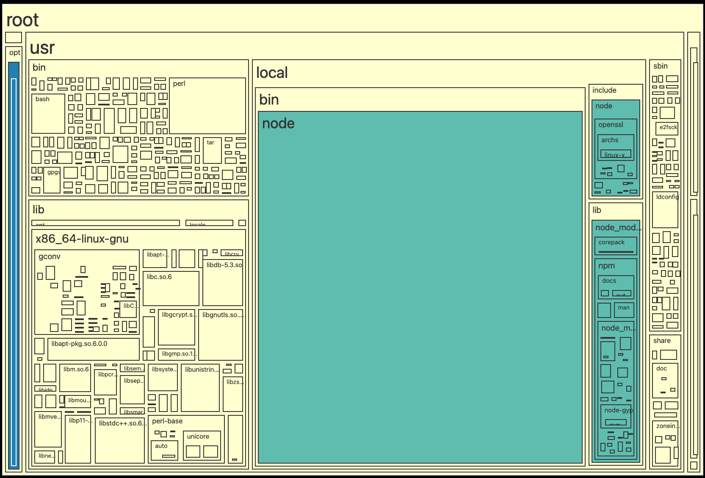

<div align='center'>
    <br/>
    <br/>
    <h3>docker-phobia</h3>
    <p>analyze Docker images and make them slim</p>
    <br/>
    <br/>
</div>

## Install

You can install docker-phobia on your path with:

```bash
curl -sf http://goblin.run/github.com/remorses/docker-phobia | sh
# or if you have go installed
go install github.com/remorses/docker-phobia
```

## Usage

```bash
docker-phobia
# Use the arrow keys to navigate: ↓ ↑ → ←
# ? Select a Docker image:
#   ▸ node:18-slim
#     postgres:latest

# or pass the image tag as an argument
docker-phobia node:18-slim
```

## Example Output

Every rectangle represents a folder or file in the image. The bigger the rectangle, the more space it takes up.

The different colors represent the different layers in the image. If two rectangles have the same color, they are in the same layer. If the color shade is similar, they are from layers close to each other.


